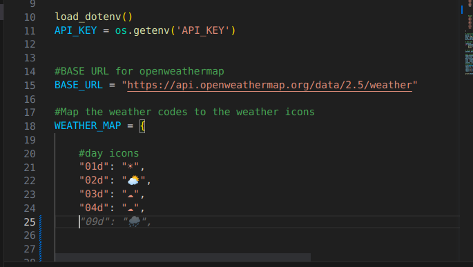
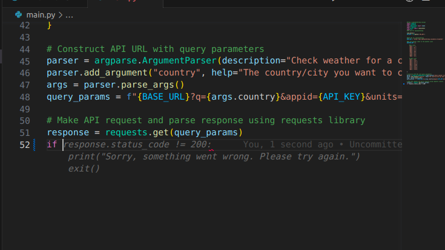
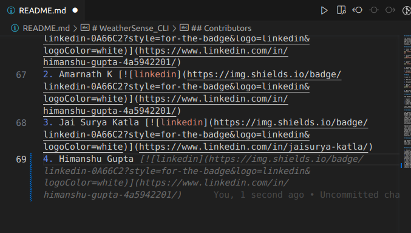

# WeatherSense_CLI

The WeatherSense_CLI Tool is a command-line interface application allowing users to obtain the current weather forecast for any city or country they choose. By utilizing the OpenWeatherMap API and leveraging the power of Python, this tool provides accurate and up-to-date weather information in a simple and convenient manner.

https://github.com/Fastest-Coder-First/WeatherSense_CLI/assets/81583897/b7643856-0ec7-4616-8a20-3bab5967a455

## Installation

1. Clone the repository to your local machine:
```bash
git clone https://github.com/Fastest-Coder-First/WeatherSense_CLI.git
```
2. Navigate to the project directory:
```bash
cd WeatherSense_CLI
```

3. Install the required dependencies:
```bash
pip install -r requirements.txt
```

4. Obtain an API key from OpenWeatherMap by creating an account on their website.

5. Rename the `.env.example` file to `.env` and replace `YOUR_API_KEY_HERE` with your actual OpenWeatherMap API key.

## Usage

To use the WeatherSense_CLI Tool, follow these steps:

1. Open a terminal or command prompt.

2. Navigate to the project directory.

3. Run the tool with the following command:
```bash
python main.py <city_name/country_name>
```

4. Wait for the tool to fetch and display the current weather forecast for the specified location.

## Dependencies

The WeatherSense_CLI Tool relies on the following dependencies:
- requests
- argparse
- pyfiglet
- simple-chalk
- python-dotenv

These dependencies are listed in the `requirements.txt` file and will be installed during the installation process.

## GitHub Copilot Experience

The WeatherSense_CLI Tool was developed with the assistance of GitHub Copilot, an AI-powered coding assistant. Copilot provides helpful code suggestions and autocompletion, making development faster and more efficient.


It helps in generating code snippets, suggesting function signatures, and even completing entire lines of code.
 

Copilot is currently in technical preview and is available as a Visual Studio Code extension. It also helped us in writing this README file.


Copilot seamlessly integrates into our workflow, providing real-time assistance and helping us overcome coding challenges. While adjustments were occasionally needed, Copilot's understanding of our project's context and alignment with our coding style impressed us. 
We believe it will continue to improve with user feedback and updates. Overall, Copilot has transformed our development process, allowing us to focus on delivering a superior user experience.

## Acknowledgments

The WeatherSense_CLI Tool was developed using the OpenWeatherMap API, which provides the weather data used in this application. We would like to express our gratitude to the developers and contributors of OpenWeatherMap for their valuable service.


## Contributors

1. Manisha Sahu [](https://www.linkedin.com/in/manisha-sahu-5575b9205/)
2. Amarnath K [](https://www.linkedin.com/in/amarnath-k-232878210/)
3. Jai Surya Katla [](https://www.linkedin.com/in/jaisurya-katla/)
4. Himanshu Gupta [](https://www.linkedin.com/in/himanshu-gupta-4a5942201/)
